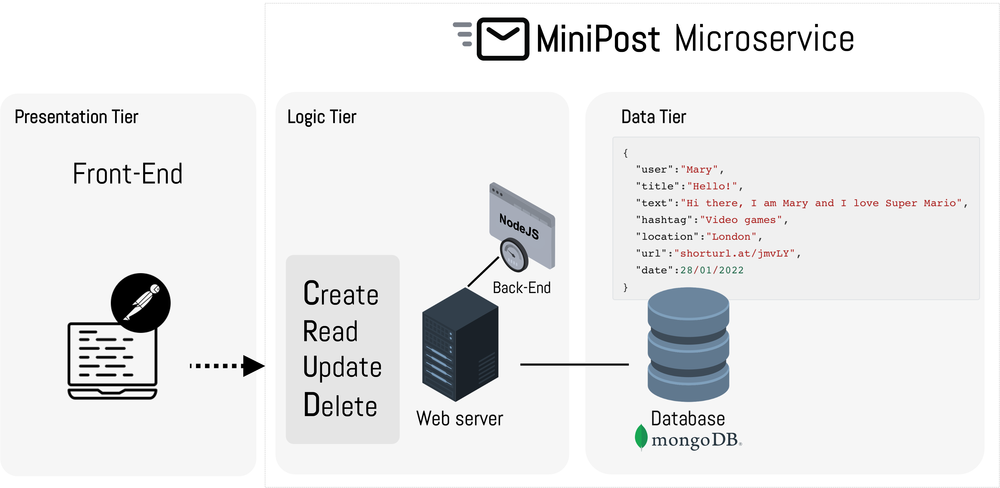

### Building a MiniPost REST microservice

This week's session focused on building a MiniPost REST microservice with an API by connecting to a MongoDB database to collect data and render it to the browser.

We've focused on how to:

* Conceptualise a REST API development for the CRUD operations:
  * **C**reate data
  * **R**ead data
  * **U**pdate data
  * **D**elete data

* Deploy a MongoDB instance on the MongoDB Atlas
* Create a MiniPost REST API using Node.js

The following image demonstrates the MiniPost microservice architecture.

